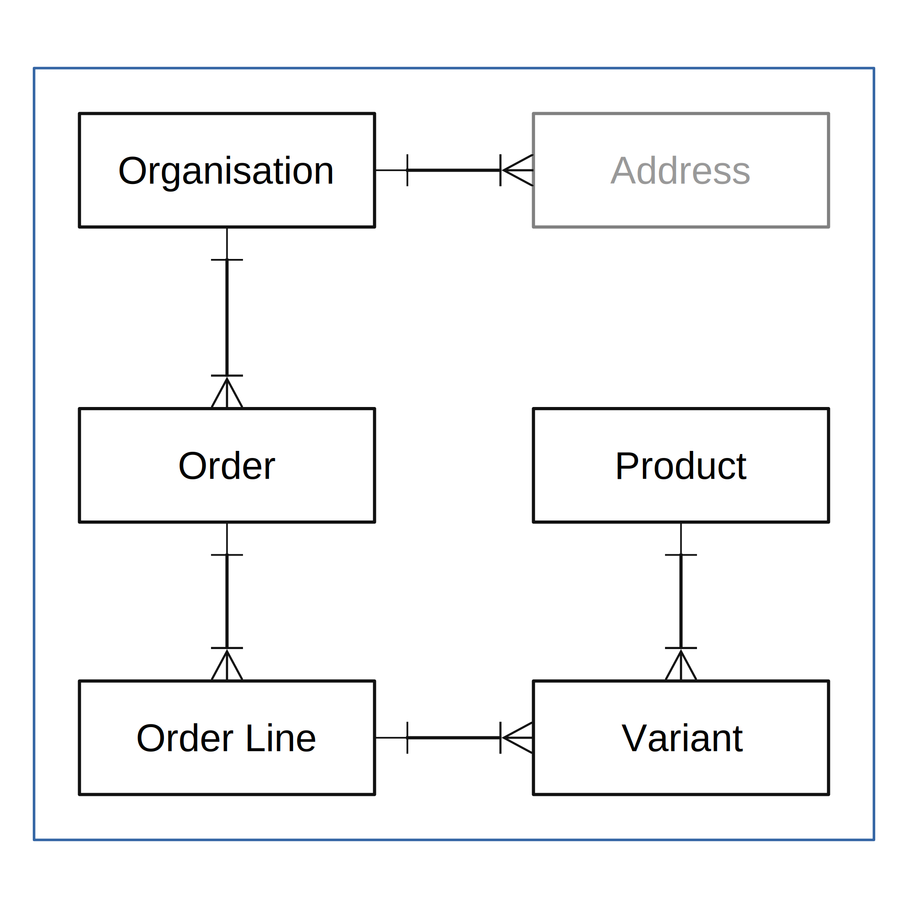

# order-view

## Introduction

## Docker

### Permission issues

There are `write` permission issues with files created from within the DOCKER containers and the host.

If there are errors writing to the log files (`storage\log\*.log`) deleting the log files will resolve them.

### Composer Issues

It is likely that composer will need to be run outside of the container. When i started the project _composer_ would not install the LUMEN app so I installed it from the host (WSL on Windows).

### Configuration

I chose to use LUMEN (see below) so did not get SAIL.

There are 2 containers -

- PHP Version 8.1 and Apache
- MySQL

I intend to work on the DOCKER install for this project to make it work with LARAVEL and NGINX, and use it for _rapid prototyping_ and for the initial build and testing APIs.

## LUMEN

LUMEN was chosen mainly for the routing functionality, and over LARAVEL mainly because I chose not to use ELOQUENT and I wanted to avoid all the _extras_ that come with LARAVEL.

On reflection (and after reading a comment on the GitHub page for LUMEN) in future my first choice will be LARAVEL - if I continue with this project it will be converted to LARAVEL.

## React

TODO:

## Application

### Start docker

```
docker build
docker up
```

To connect to the containers -

```
docker exec -it local_db bash
docker exec -it local_web bash
```

### Import

> The .csv files are not included with the repository, you will need to add them.
>
> The tables will need to be `TRUNCATED` (or use `artisan` to `wipe` and `migrate`) between runs of the import.

The URL below will import the **products and variants**, and **organizations** and **orders** from a single file - `storage\app\TestOrders.csv`.

```
http://localhost:8080/api/import/all
```

The results are return as JSON.

#### Order Update
Once created there is no update to the orders.

#### Product and Variant Update

A product is updated if the `ean` or `name` column are different (the columns were chosen as an example).

A variant is updated if the `price` column is different.

### Addresses

The addresses are not imported with the organizations, they are stored with the order.

### Development Testing

For testing the **products and variants**, and **organizations** were extracted from the `TestOrders.csv` file into an `Organizations.csv` file and a `Products.csv` file.

The URLs below are used during development -

```
http://localhost:8080/api/import/organizations
http://localhost:8080/api/import/orders
http://localhost:8080/api/import/products
```

The results are return as JSON.

The data in them repeats (all the the rows from `TestOrders.csv` were used) and there are columns that aren't needed for the **organizations** - that formed part of the testing.

For those URLs to work there must be a `storage\app\Organizations.csv` file, a `storage\app\Products.csv` file and a `storage\app\TestOrders.csv` file.

It isn't necessary to split the `TestOrders.csv` because the imports ignore the extra columns.

## Database

### Simple ER Diagram



The address table was not added. Originally I had thought of storing addresses against the **organizations** as being _valid to send to_.

### Seeder

There is a seeder for the **Organizations**, although it is not needed because they can be imported from a .csv file.

## TODO

As part of the validation add functionality to verify the needed columns are present (WIP) on the `.csv` file.

Add a cache added to the import for `products` and `variants`.

With some work the import functions in the **Models** could be generalized and moved into `App\Models\Base`.

The import could report the *successes* as well as the failures.
